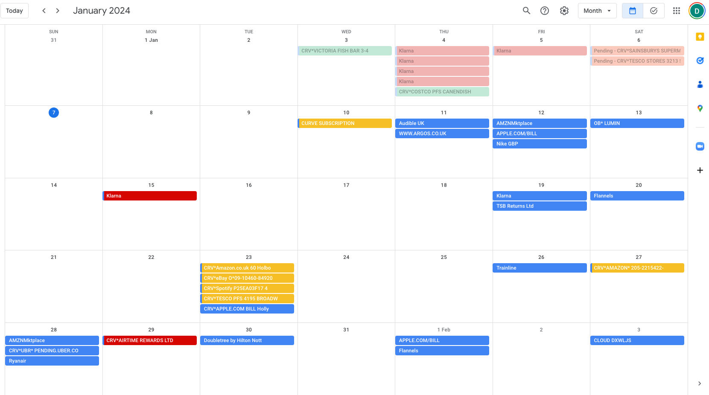

# Plutus Cashback Tracker

### Intent

Plutus offers a crypto cashback card that provides 3-9% cashback on transactions, along with a perks system granting up to £10 cashback at specific merchants. However, the cashback is not released until 45 days after the transaction, making it difficult to track the status of these rewards. 
To address this, I created a script to monitor the progress of my cashback rewards.

### Design

This script is designed to:

- Add events to my Google Calendar indicating when cashback rewards will become available.
- Identify and provide details on transactions that have been rejected for rewards, along with the reasons for rejection. 
This information, while not displayed on the Plutus portal, is accessible through their API.

**API Integration**: The script leverages the hidden API of Plutus for streamlined login and direct access to my transaction and reward data.
**Containerized Lambda Function**: Deployed as a containerized image in AWS Lambda, the script is set to run automatically every morning.

### Visualization in Google Calendar

The script visually represents the status of cashback rewards in Google Calendar as follows:

- **Blue**: Transactions within the 45-day waiting period for cashback release.
- **Red**: Transactions that have been rejected for rewards.
- **Green**: Transactions where cashback rewards have been released.
- **Yellow**: Transactions qualifying for perk rewards.

