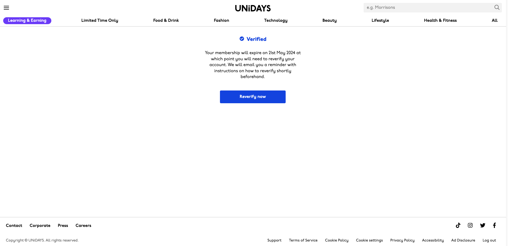
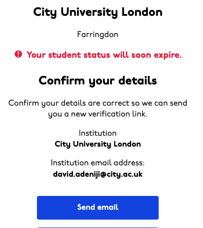

# Unidays Membership Renewal Automation

### Notice of Deprecation
Important: I don't personally use this script anymore as my student email was deactivated a year after graduation, rendering the script inoperable for continued Unidays membership renewal :(

### Intent

The intent of this script was to automate the renewal of my Unidays membership. 
Unidays, a service offering discounts for students, requires regular verification of student status, which involves logging in and confirming through a verification email. 
This process, although simple, can be repetitive and time-consuming.

To streamline the renewal process, the script interacts directly with Unidays' API, bypassing the need for web navigation through tools like Selenium. 
This approach not only simplifies the code but also enhances the efficiency of the automation.

### Design

The key features of this script include:

- **API Integration**: Utilizes the hidden API of Unidays for a more efficient login and verification process.
- **Automated Verification**: The script automatically logs in using my credentials and initiates the student status re-verification process.
- **Scheduled Execution**: A cron job on AWS Lambda is set to trigger the script every Monday morning, ensuring regular maintenance of the Unidays membership.